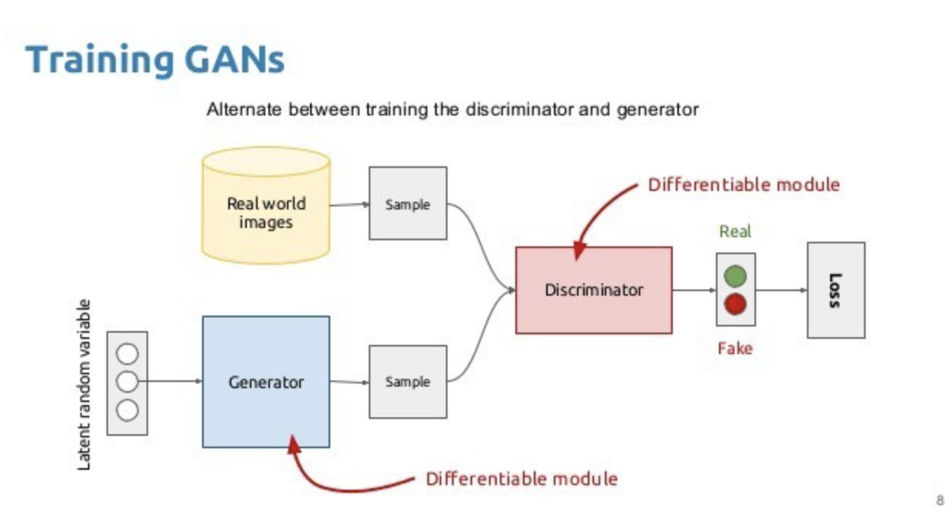
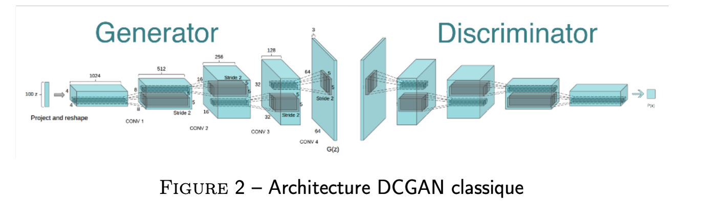
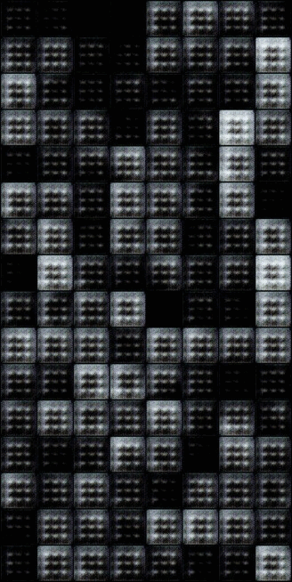
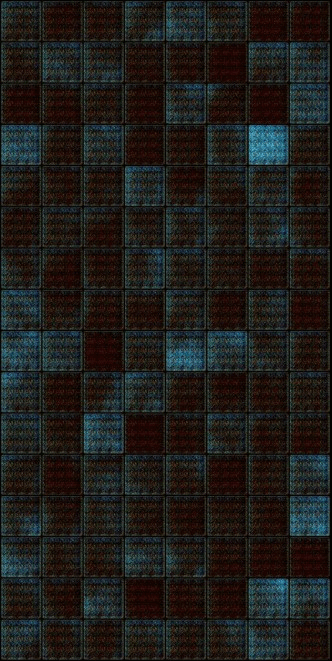

# From_GAN_to_DCGAN

## Introduction
This project aims at adressing a quick review on the principles of the generative adversarial network (GAN)  and its limits. Then we will implement a DCGAN network (Deep Convolutional GAN). This network will be used to generate art and food images.

## Table of contents
* [Getting started](#getting-started)
    * [GAN](#generative-adversarial-network)
    * [DCGAN](#Deep-Convolutional-GAN)
* [Prerequisities](#Prerequisities)
* [Usage](#usage)
* [Results](#results)


## Getting started
First of all, we will briefly return to the concept of the generative adversarial network, its architecture and its applications.


## GAN 
The objective of the GAN is to generate realistic data, which means plausible according to a probability
distribution of a real data. 
Technically, GANs are composed of two neural networks. The generator and the discriminator. The purpose of the generator, as the name suggests, is to generate the new object. The discriminator must determine whether the generated object is real or not. This is where the great efficiency of GANs comes from figure below).



It is in competition that we improve, and this is also valid for AI. What we observe during the training of the generator and the discriminator, is that the two models improve simultaneously, each in the task assigned to it.

## DCGAN
DCGAN uses convolutional and convolutional-transpose layers in the generator and discriminator, respectively. It was proposed by Radford et. al. in the paper [Unsupervised Representation Learning With Deep Convolutional Generative Adversarial Networks](https://arxiv.org/pdf/1511.06434.pdf).  Here the discriminator consists of strided convolution layers, batch normalization layers, and LeakyRelu as activation function. It takes a 3x64x64 input image. The generator consists of convolutional-transpose layers, batch normalization layers, and ReLU activations. The output will be a 3x64x64 RGB image(figure below).




### Prerequisities
​
Such code can be smoothly run on any Unix system with Python installed. Even though a GPU is highly encouraged to speed up both training and inference time processing, the model can be used as-is on CPU. 
​
The whole code is build opon the PyTorch deep learning framework, and has only few requirements regarding its esssential library. 
​
​
## Installation

Clone the repo first : 
```
git clone https://github.com/malekyoussefIA/From_GAN_to_DCGAN
```
and 
```
cd /From_GAN_to_DCGAN
```
​
* To build up a new virtual environment:
```python 
python3 -m venv .venv
source .venv/bin/activate
pip install -r requirements.txt
```

## Usage 
### Training

Make sure to update the "configs/config.yaml" file with the right paths to your data and the right parameters.
Training can be launch (either on GPU or CPU) with : 

```bash python -m train.dcgan
```


## Results
Below we can visualise the evolution of the generator ouptputs through the epochs (epoch 1-->epoch 25-->epoch 100).

For food :

                                          


For art paintings



